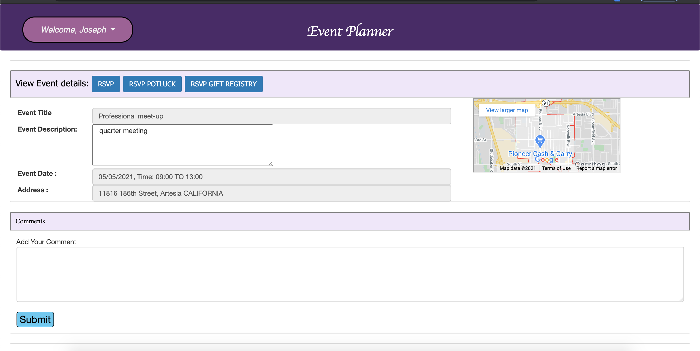
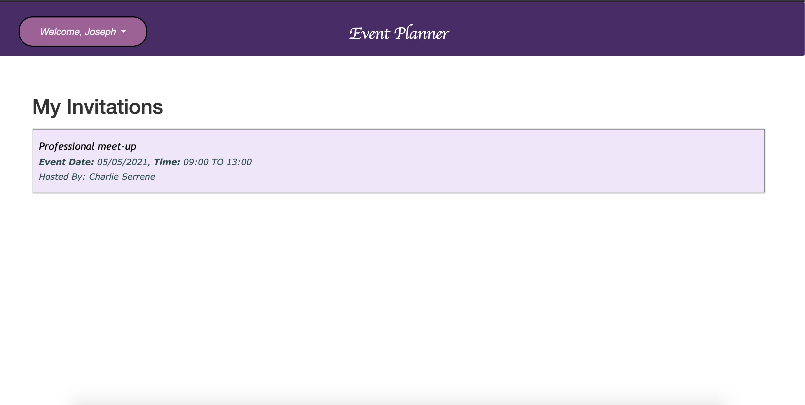
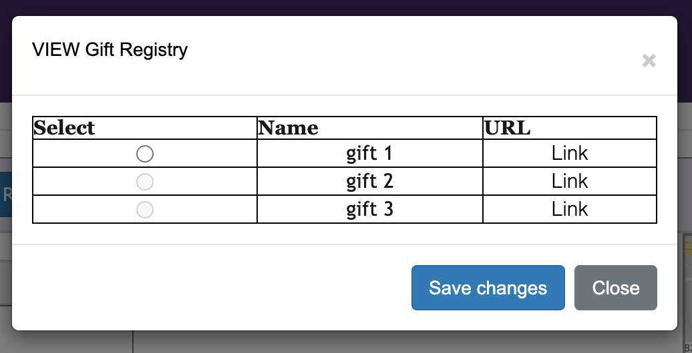

# project_2_team_5

 [Technology-Stop-And-Blog](#Technology-Stop-And-Blog)
    - [Table of Contents](#table-of-contents)
  * [Motivation](#motivation)
  * [Description](#description)
  * [Pre-requisite](#pre-requisite)
  * [Demo](#demo)
  * [Technologyused](#technologyused-)
  * [Install](#install-)
  * [Codebase](#codebase)
  * [Application Walk-through](#Application-walk-through)

## Motivation
<strong> MOTIVATION:</strong>  
The motivation behind this project was to create an app that lets users create events and see what events they are attending. We wanted an app where people could host events, see what events they are attending and also add what they want to bring to the event if there is a potluck or a gift registery. Project creation is for the UT Austin Coding Bootcamp 2020/2021

## Description
This application allows a host to schedule an event online , in-person or an announcement for a few different types of events: Potluck & Party. 
Host can send invites to recipients via email, also add items that participants can contribute or gift registries they would like to bring to the event or announcement which is open for all who have access to the application.
Invitees can RSVP to the event with the number of adults & kids, choose available options for potluck & gifts that they would like include. They can view all received invitations from different hosts within their account.
Host can view RSVP details of participants to get a better idea of who will attend the event.

<strong>Features </strong>
The difference between our app and other event planning apps is that we utlize the functions of allowing guests to have a potluck feature and gift registery feature to make the event more oragnized.  

## Pre-requisite
Install NodeJS 

## Demo

## Technologyused:
<ul>
    <li> 
    <a href="https://sequelize.org/" target="_blank">Sequilize  <a>
     
    </li>
    <li> 
    <a href="https://nodejs.org/en/docs/" target="_blank">NodeJS <a>
    <li> 
    <a href="https://expressjs.com/en/guide/routing.html" target="_blank">Express.js<a>
    </li>
    <li> 
    <a href="https://dev.mysql.com/doc/" target="_blank">mySQL2 </a>
    </li>
     <li> 
    <a href="https://handlebarsjs.com/" target="_blank">Handlebars </a>
    </li>
</ul>
     NPM packages:  
    session, bcrypt, body-parser,connect-session, sequelize, express-handlebars, mysql2, nodemon,   sweet alert.

## Install:
<strong>Code installation:</strong>  
$ cd [path_to_save_codebase]  
$ git clone https://github.com/arti-karnik/EventMaker 

Add env file:  
Go to Folder, add new file name it as .env  
DB_USER='<your mysql username>'  
DB_PASSWORD='<your mysql password>'  
DB_NAME='EventPlanner_db'  

Installing Database:  
1. Via Terminal:  
msql -u root -p  <press enter>  
DROP DATABASE IF EXISTS EventPlanner_db; <press enter>   
CREATE DATABASE EventPlanner_db;   <press enter>  

2. Using mysql work bence:  
Open sql work bence  
DROP DATABASE IF EXISTS EventPlanner_db;
CREATE DATABASE EventPlanner_db;  

<strong> Run the application: </strong>  
Open Terminal  
$ npm install  
$ npm run seed  
$ npm start  

<strong>How to use</strong>
This app uses the basic functionality of any common website but also allows users to create a login, create events,  
see what events they are attending as well as add to the potluck and gift registery depending on event.  

## Codebase
Github Repo: https://github.com/arti-karnik/EventMaker

## Application Walk-through
<a href="https://serene-oasis-98788.herokuapp.com/" target="_blank"> Click here for Application Live url </a>

<strong>Process: </strong>
1. Run npm init -y.  
2. Install npm packages.  
3. Work feature by feature to implement the framework.  
4. Create server file.  
5. Create and seed database.  
6. Create models.  
7. Deploy to Heroku.  
8. Create homepage using api routes, handlebars, utils and helpers.  
9. Create login page using api routes, handlebars, utils and helpers.  
10. Create event page using api routes, handlebars, utils and helpers.  

<strong>Contribute</strong>
Please contact creators of the app. 

<strong> Credits </strong>
 

<strong> License </strong>
MIT licenses

© Arti Karnik
